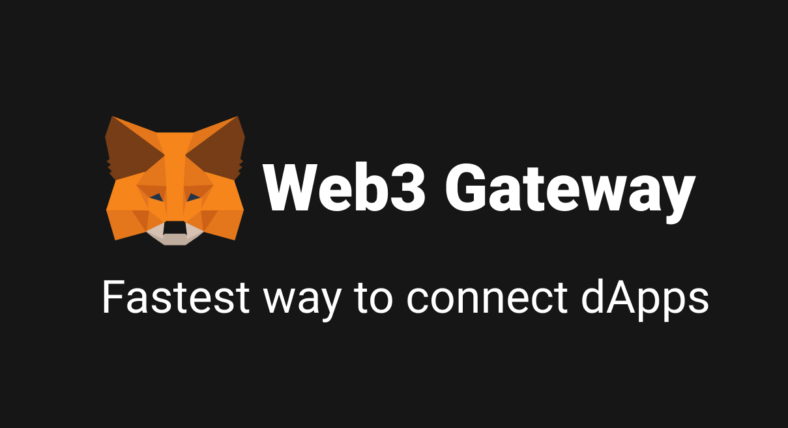

<p align="center"></p>

# Web3 Gateway

A SPA for add custom networks to MetaMask with once click

## Environment

```zsh
$ node -v
v14.17.3
$ yarn -vs
v1.22.10
```
## Dependencies

### For Application

- [axios](https://github.com/axios/axios)
  - Promise based HTTP client for the browser and node.js
- [comet-ui-kit](https://github.com/roy1210/comet-ui-kit)
  - UI library based on styled-components
- [framer-motion](https://github.com/framer/motion)
  - Open source, production-ready animation and gesture library for React
- [@metamask/logo](https://github.com/MetaMask/logo)
  - A 3d take on the metamask logo, in browser, as a browserifyable module.
- [next-seo](https://github.com/garmeeh/next-seo)
  - Next SEO is a plug in that makes managing your SEO easier in Next.js projects.
- [pino](https://github.com/pinojs/pino)
  - super fast, all natural json logger
- [polished](https://github.com/styled-components/polished)
  - A lightweight toolset for writing styles in JavaScript
- [styled-components](https://www.styled-components.com/)
  - Visual primitives for the component age. Use the best bits of ES6 and CSS to style your apps
- [react-cookie-consent](https://github.com/Mastermindzh/react-cookie-consent)
  - A small, simple and customizable cookie consent bar for use in React applications.
- [react-github-corner](https://github.com/skratchdot/react-github-corner)
  - Add a Github banner to your project page.
- [react-intl](https://github.com/formatjs/formatjs)
  - The monorepo home to all of the FormatJS related libraries, most notably react-intl.
- [react-qrcode-logo](https://github.com/gcoro/react-qrcode-logo)
  - React + Typescript component to generate a QR Code with custom colors and logo
- [react-tabs](https://github.com/reactjs/react-tabs)
  - An accessible and easy tab component for ReactJS.
- [react-toggle-dark-mode](https://github.com/JoseRFelix/react-toggle-dark-mode)
  - A sleek dark mode toggle button for React.
- [redux](https://github.com/reduxjs/redux)
  - Predictable state container for JavaScript apps
- [react-redux](https://github.com/reduxjs/react-redux)
  - Official React bindings for Redux
- [redux-devtools-extension](https://github.com/zalmoxisus/redux-devtools-extension)
  - Redux DevTools extension.
- [react-spinners](https://github.com/davidhu2000/react-spinners)
  - A collection of loading spinner components for react
- [rodal](https://github.com/chenjiahan/rodal)
  - A React modal with animations.
- [web3](https://github.com/ethereum/web3.js)
  - Ethereum JavaScript API

### For Development

- [husky](https://typicode.github.io/husky/#/)
  - Modern native Git hooks made easy

## Package manager

- [yarn](https://yarnpkg.com/)
  - Fast, reliable, and secure dependency management.

## How To Use

```bash
yarn
yarn dev
```

## Translation

This project is using [react-intl](https://github.com/formatjs/formatjs) to handle localization.
Please refer to `src/modules/i18n/files/LANGUAGE.json` file to add or edit sentences.

## SEO

This project is using [next-seo](https://github.com/garmeeh/next-seo) to handle SEO settings. Please
refer to `src/modules/seo/index.tsx` file to add or edit sentences.

## How To Contribute

When you push your branch to remote ones, please run `yarn lint --fix` to comply to the code convention.

When you add a new library, please make sure its license is not
[GPL](https://en.wikipedia.org/wiki/GNU_General_Public_License). And please use `-D` for @types.

